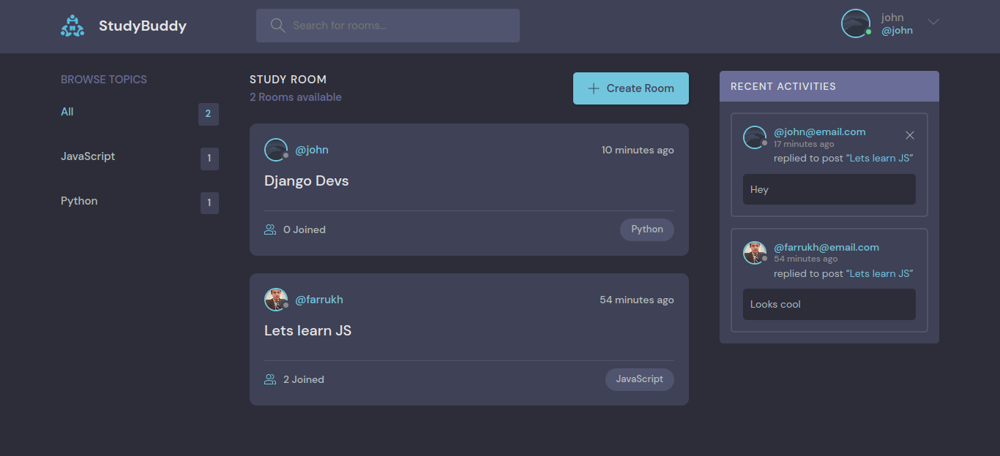
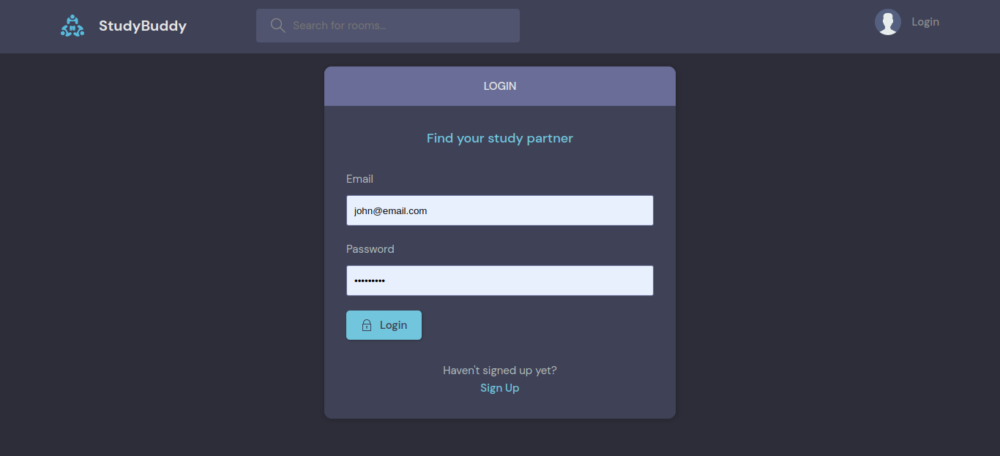
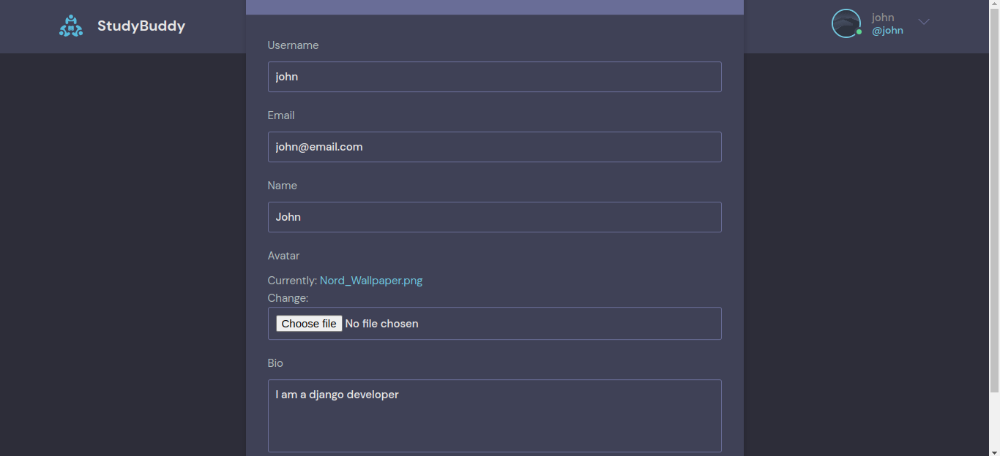
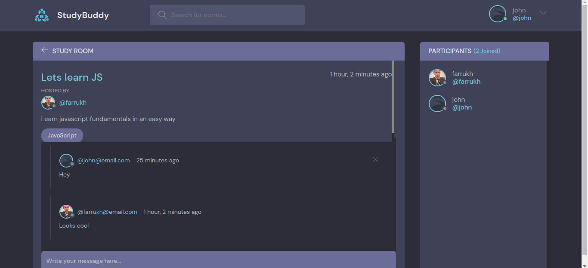
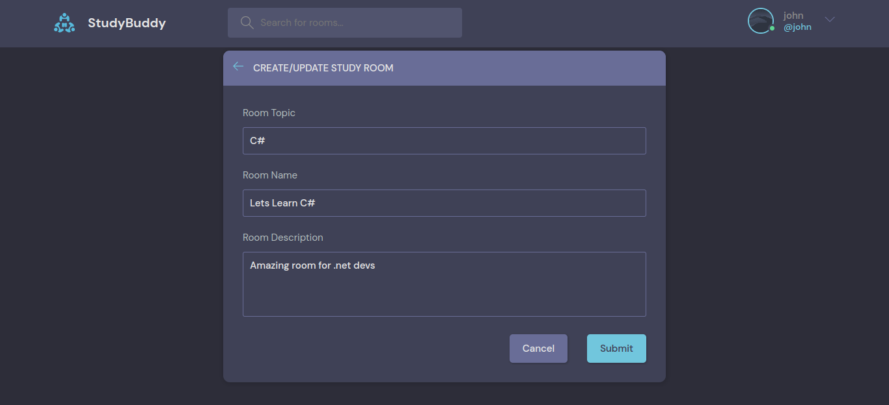

# studyBud

A simple web project using Django, HTML,CSS to create a website where a user can create rooms for specific topics and other users can search different topic and can add messages to them

<h5>To start the project run following commands</h5>

<code>python3 manage.py makemigrations</code>
 
<code>python3 manage.py migrate</code>
 
<code>python3 manage.py runserver</code>

<h5> Here are the some screenshots of the application </h5>

